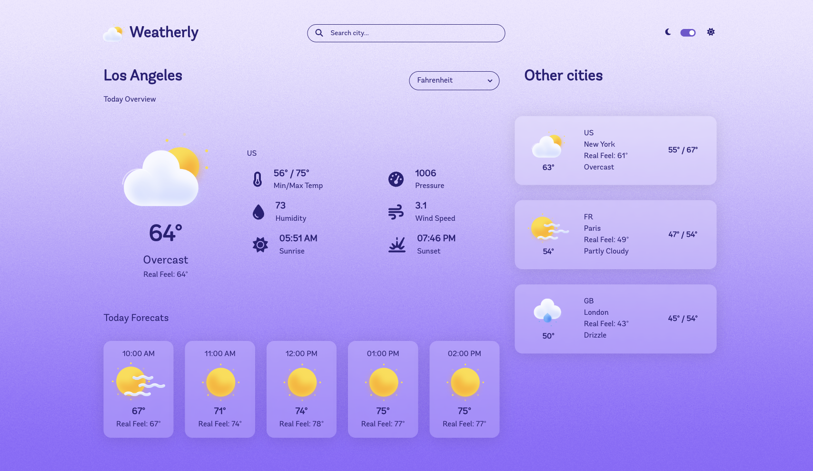

# Weatherly

A responsive weather dashboard built with React 18, JavaScript, and SCSS. Fetches live weather data from the Open-Meteo API — no API key required.

**Live Demo:** https://CesarSG.github.io/WeatherlyWeb/



---

## Features

- **Live weather data** — current conditions fetched from the Open-Meteo API via geocoding + forecast endpoints
- **Current conditions** — temperature, real feel, min/max, humidity, pressure, wind speed, sunrise & sunset
- **Hourly forecast** — next 5 hours with weather icon and temperature
- **Multi-city panel** — simultaneous weather cards for New York, Paris, and London
- **City search** — look up any city by name with error handling for invalid inputs
- **Unit toggle** — switch between Fahrenheit/Celsius (°F / °C) and mph/km/h
- **Dark/light mode** — full theme switch with day and night background imagery
- **Animated transitions** — smooth UI animations via Framer Motion
- **Responsive layout** — mobile-first grid using Bootstrap, adapts from phone to desktop

## Tech Stack

| Layer | Technology |
|---|---|
| UI framework | React 18 |
| Language | JavaScript (JSX) |
| Styling | SCSS + Bootstrap 5 |
| Component library | Chakra UI, React-Bootstrap |
| Animations | Framer Motion |
| Icons | Font Awesome 6 |
| Build tool | Vite |
| Weather API | Open-Meteo (free, no key) |
| Date formatting | Moment.js |

## Getting Started

```bash
npm install
npm run start
```

Open [http://localhost:5173](http://localhost:5173) in your browser.

### Other commands

```bash
npm run build    # Production build
npm run preview  # Preview the production build locally
npm run lint     # Run ESLint
```

## Project Structure

```
src/
├── components/
│   ├── CurrentWeather.jsx   # Current conditions panel
│   ├── ForecastWeather.jsx  # Hourly forecast cards
│   ├── MultipleWeather.jsx  # Multi-city sidebar
│   ├── Header.jsx           # Search bar and theme toggle
│   ├── SelectUnit.jsx       # °F / °C unit switcher
│   ├── Switch.jsx           # Dark/light mode toggle
│   └── Loader.jsx           # Loading spinner
├── context/
│   └── ThemeContext.jsx     # Global theme, unit, and city state
├── hooks/
│   └── useWeather.js        # Data fetching logic (current, forecast, multi-city)
├── reducer/
│   └── DataReducer.js       # useReducer handler for API state
├── utils/
│   ├── config.js            # API endpoints and preset cities
│   ├── helpers.js           # Temperature formatting and time utilities
│   ├── images.js            # WMO weather code → icon mapping
│   └── theme.js             # Theme helpers
├── styles/                  # Per-component SCSS modules
└── assets/                  # Weather icons and day/night backgrounds
```

## License

[MIT](LICENSE)
